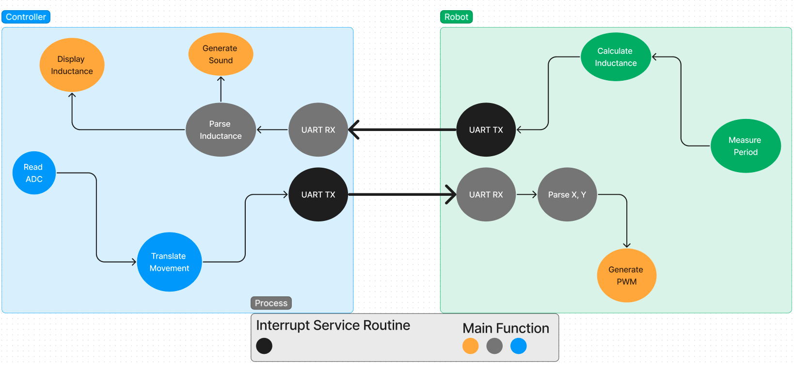
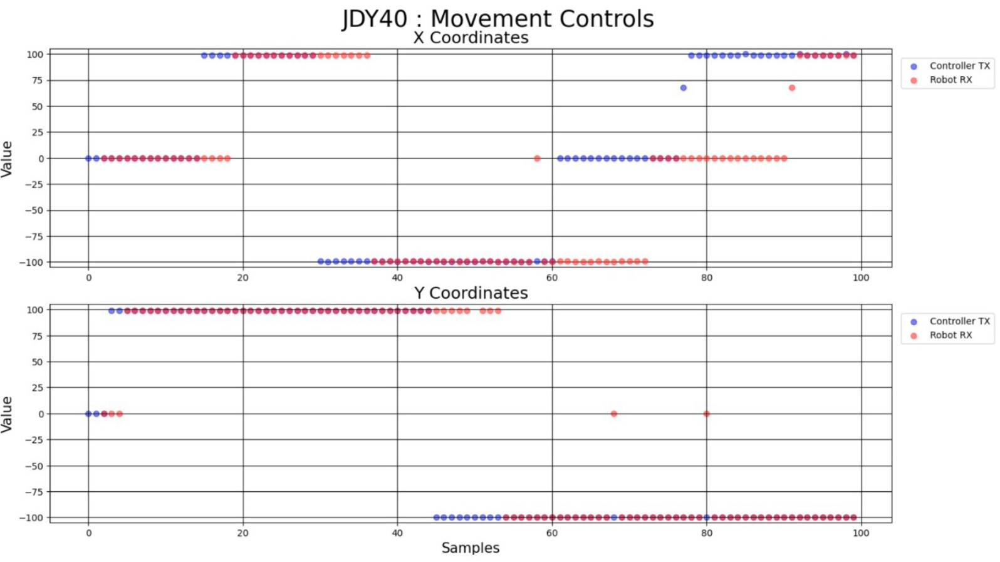
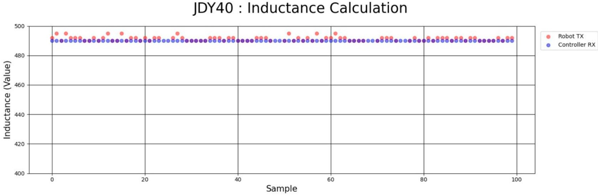

# Metal Detector Robot

## Contents

* [Overview](#Overview)
* [System Architecture](#System-Architecture)
    * [Real-Time Response](#Real-Time-Response)
        * [User Acceptance Testing](#User-Acceptance-Testing)
        * [Regression Testing](#Regression-Testing)
* [Controller](#Controller)
* [Robot](#Robot)
* [Demonstration](#Demonstration)
* [Credit](#Credit)

## Overview

We designed a wirelessly controlled, battery operated robot which detects metal with principles of electromagnetic induction.

## System Architecture

There was a separate circuit for a remote controller and the robot itself. A pair of **JDY-40** radios, connected via **UART**, enabled data transmission to and from the robot. This was comprised of subcircuitry, particularly **Octocouplers** and **H-bridges**, to drive vehicular movement.

We have detailed how the robot and controller achieve the desired system functionality in this following [Architecture Diagram](https://www.figma.com/file/xqH8FoNDTfE8aC5VBbZg7c/ELEC-291-%3A-Project-2%2C-Firmware-Block-Diagram?type=whiteboard&node-id=0%3A1&t=QKUpWGOVw9C2EUxE-1). This is done through deterministic acquisition, transmission, and handling of data with both the electrical and firmware design.

    

### Real-Time Response

The controller was programmed to transmit movement coordinates to the robot. The robot was programmed to transmit a calculated inductance corresponding to the amount of detected metal.

Notice how receives were implemented through the `main` program and are synchronous tasks. We designed the **UART** transmission to be implemented asynchronously via **ISR**. There was a transmission delay of *200 ms* implemented from both microcontrollers. This enabled the **JDY-40** to transmit and receive data at a rate which kept data accuracy and response at an acceptable threshold.

#### User Acceptance Testing

We validated this with end-to-end testing on the actual robot with a human user (i.e. somebody other than the firmware owner for the system component).

## Regression Testing

We logged transmitted and received data to the **Serial Port** and analyzed data accuracy as well as latency with the [`coordinate_logger.py`](/Regression_Tests/Coordinates/coordinate_logger.py) and [`inductance_logger.py`](/Regression_Tests/Inductance/inductance_logger.py) **Python** scripts.

From the following data, we determined that the number of samples between data transmission was within a very small acceptable range and that accuracy was consistently high with input variation.

    

    

## Controller

The remote controller circuitry consisted of an **STM32** microcontroller with **ADC** joystick inputs, as well as visual/auditory feedback in the form of an **LCD** display and speaker.

### Extra Features

There is a software enabled passcode used to unlock the controller. The speaker emits sounds of different frequencies for each key for user feedback. We also transmitted a *z* coordinate in addition to *x,y* movement coordinates for an extra feature on the robot.

The controller firmware can be found in the [Controller](/STM32/Controller) directory.

## Robot

The robot circuitry was used to generate **Pulse-Width Modulation** (**PWM**) signals and drive the wheels for movement. A **Colpitts Oscillator** circuit was used to measure the period of a looped coil, and determine the equivalent inductance to detect magnetic material property.

### Extra Features

The *z* coordinate was used to implement an auto-parking feature in which a single command enabled the robot to conduct a front parking without user assistance into a designated spot.

The robot firmware can be found in the [Robot](/EFM8/Robot) directory.

## Demonstration

We have uploaded our Final Demo on <a href="https://www.youtube.com/watch?v=mVCBSWdCpsY" target="_blank">Youtube</a>. We have also attached our [report](/Report/ELEC291_TeamA9_MetalDetectorRobot.pdf) for detailed observation of our engineered solution.

## Credit

This project was completed as part of the <b>The University of British Columbia Electrical and Computer Engineering</b> undergraduate program. The <b>ELEC 291 - Design Studio</b> course requirement was to complete this project. We received tremendous assistance and support from Dr. Jesus Calvino-Fraga in completing this.